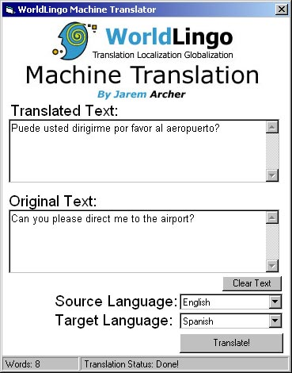



## Nine Language Translator\!\!\!\!\!\!\!\!

### Description

Thats right, it translates English, French, German, Spanish, Japanese, Korean, Portuguese, Chinese, and Italian from the WorldLingo Database!It works perfect execpt needs a bit of ascii corrections.
 
### More Info
 
Uses Inet to download the translation, then parses the info.

             |
---                |---
**Submitted On**   |2001-09-04 19:29:04
**By**             |[Jarem Archer](https://github.com/Planet-Source-Code/PSCIndex/blob/master/ByAuthor/jarem-archer.md)
**Level**          |Intermediate
**User Rating**    |3.8 (23 globes from 6 users)
**Compatibility**  |VB 5\.0, VB 6\.0
**Category**       |[Complete Applications](https://github.com/Planet-Source-Code/PSCIndex/blob/master/ByCategory/complete-applications__1-27.md)
**World**          |[Visual Basic](https://github.com/Planet-Source-Code/PSCIndex/blob/master/ByWorld/visual-basic.md)
**Archive File**   |[Nine Langu25905942001\.zip](https://github.com/Planet-Source-Code/jarem-archer-nine-language-translator__1-26973/archive/master.zip)

